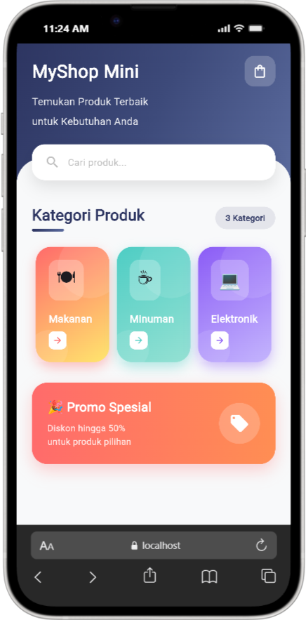
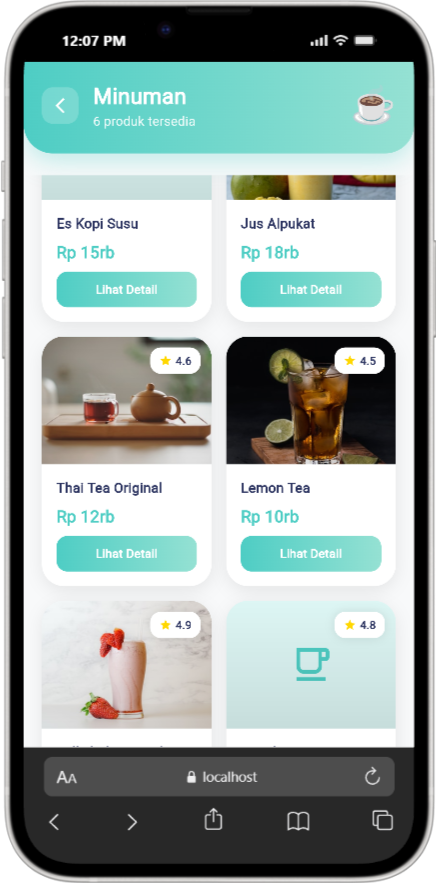
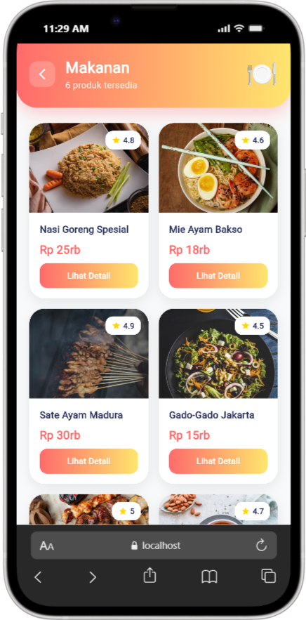
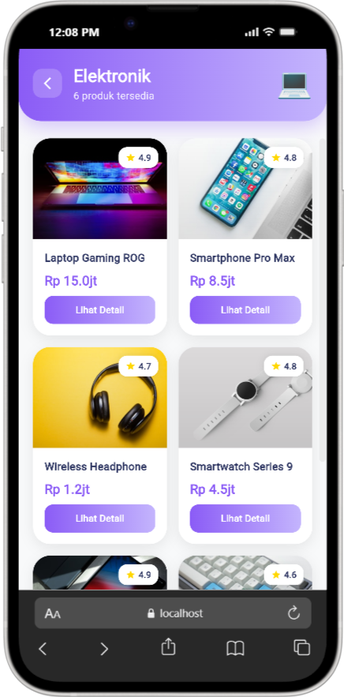
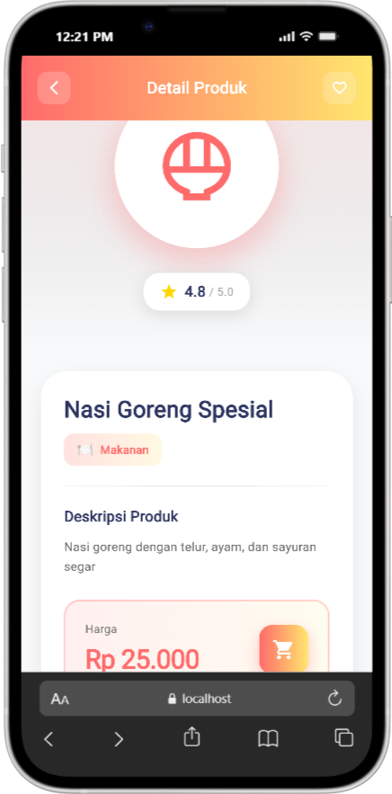

# 🛍️ MyShop Mini - UTS Mobile Programming

---

## 📄 Dokumen Laporan

**[📥 Klik Disini untuk Mengunduh/Melihat Laporan UTS (PDF)](<221080200086_Muhammad Hafizh Fattah_7A1_UTS PEMOGRMBL.pdf>)

---

## 👤 Informasi Mahasiswa

| Item | Detail |
| :--- | :--- |
| **Nama** | **Muhammad Hafizh Fattah** |
| **NIM** | **221080200086** |
| **Mata Kuliah** | Mobile Programming (INF23531) |
| **Sifat Ujian** | Project (Aplikasi E-Commerce Sederhana) |

---

## 🎯 Deskripsi Proyek

**MyShop Mini** adalah aplikasi *mobile e-commerce* sederhana yang dibangun menggunakan Framework Flutter. Aplikasi ini dirancang untuk mendemonstrasikan implementasi:
* **Layouting Modern:** Penggunaan Grid, Row, Column, dan Stack.
* **Navigasi:** Perpindahan antar halaman (*Routing*).
* **Passing Data:** Mengirim data antar screen.
* **Image Loading:** Memuat gambar produk dari internet (URL).

---

---

## ✨ Fitur Utama

1.  **Halaman Utama (Home):**
    * Menampilkan 3 kategori utama: Makanan, Minuman, Elektronik.
    * Desain kartu kategori horizontal yang interaktif.
2.  **Halaman Daftar Produk (List):**
    * Menampilkan produk sesuai kategori yang dipilih.
    * Layout menggunakan **GridView** 2 kolom yang responsif.
    * Menampilkan gambar produk, nama, rating, dan harga.
3.  **Halaman Detail Produk:**
    * Menampilkan gambar produk ukuran besar.
    * Informasi detail deskripsi dan tombol simulasi "Beli Sekarang".

---

---

## 📸 Screenshots

| Home Screen | PL Minuman | PL makanan | PL Elektronik | Product Detail |
| :---: | :---: | :---: | :---: | :---: |
|  |  |  |  |  |

---

## 🛠️ Widget & Teknologi

Aplikasi ini dibangun menggunakan komponen-komponen berikut:

* **Structural:** `MaterialApp`, `Scaffold`, `SafeArea`, `Stack`.
* **Layout:** `Column`, `Row`, `Container`, `Expanded`, `SizedBox`, `Padding`, `Center`.
* **List & Grid:** `GridView.builder`, `SliverGridDelegateWithFixedCrossAxisCount`.
* **Konten & Visual:**
    * `Image.network`: Mengambil gambar produk dari Unsplash.
    * `Text`: Menampilkan tipografi yang jelas.
    * `Icon`: Ikon UI material design.
    * `Card` & `BoxDecoration`: Memberikan efek bayangan dan sudut membulat.
* **Navigasi:** `Navigator.push` dan `Navigator.pop`.

---